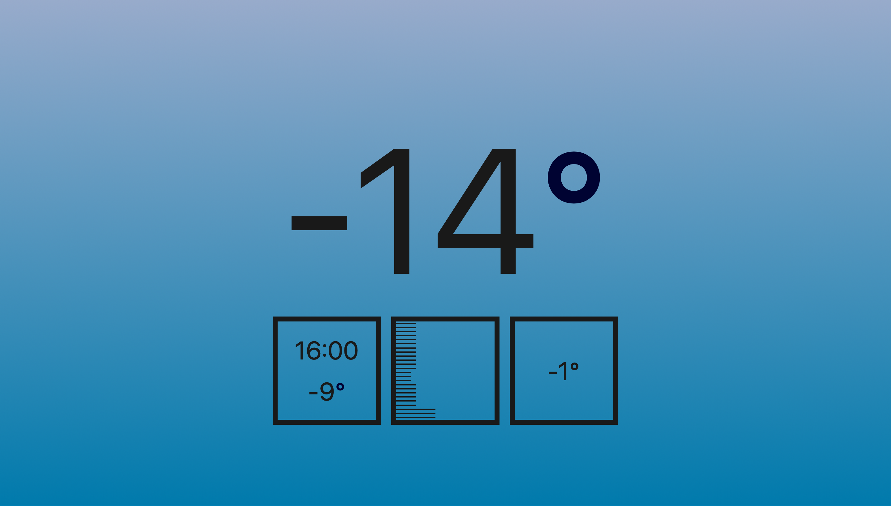

# Really Simple Weather

A front-end to display weather data from Environment Canada. You could call it a very opinionated weather app. It shows only the information I'm interested in, with no labels.

## Build With

* React
* Redux
* HTML 5
* CSS 3

## Live Demo

[Deployed Here](https://cocky-galileo-b78599.netlify.app)

## Status

_Mostly Done_

Would like to add:
* More tests to strengthen code
* A city selector

## Contact

Created by [@drdevlin](mailto:drdevlin@fastmail.com) Devlin Russell.
